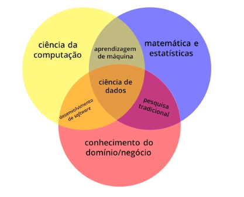
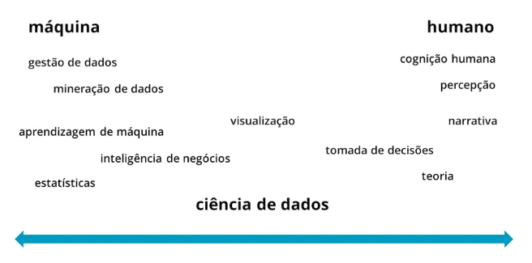
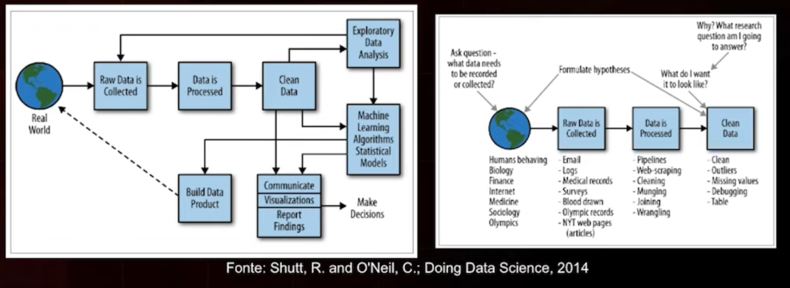

# Ciência de Dados (Data Science)
Área interdisciplinar  voltada para o estudo e a análise de dados, que visa a extração de conhecimento, detecção de padrões e/ou obtenção de insights para possíveis tomadas de decisão.   

Estuda desde a produção ao descarte de dados.   
Pode estudar qualquer conjunto de dados (mesmo que não for Big data). 

É a ciência que analisa dados brutos para extrair conhecimento útil deles. 

Preocupa-se com a criação de modelos capazes de extrair padrões de dados complexos (informações, conhecimento) e com o uso desses modelos em problemas reais.  

Envolve princípios, processos e técnicas para entender fenômenos por meio da análise (automatizada) de dados. 

Partindo do princípio que é uma ciência, a ideia é que se gere hipóteses a partir de uma observação e então utilize dados para compreender se a hipótese se confirmará ou não, utilizando de forma estratégica posteriormente.

## Diagrama de Venn

  

## Processos de ciência de dados

* Preparação dos dados;
* análise exploratória;
* escolha do modelo;
* ajuste do modelo;
* validação do modelo.

# Visualização

https://datavizproject.com/  

* Um dos principais artifícios da comunicação da humanidade.

* Envolve a arte de facilitar a percepção do todo.

* A ideia principal de uma visualização de dados por meio de imagens, gráficos ou cartografias é simplificar conteúdos de forma a permitir a compreensõa de uma ideia geral do todo.

* É um recurso que facilita o processo de compreensão e de tomada de decisão em praticamente todas as áreas do conhecimento.

* É importante entender para que serve cada tipo de gráfico e a melhor forma de visualizar os dados.

# Big Data
Dados muito grandes ou muito complexos para serem gerenciados por técnicas tradicionais de processamento, análise e armazenamento de dados.  

Está preocupado com a tecnologia que pode ajudar a lidar com a grande quantidade de dados.  

## Características

### Volume
Quantidade de dados que temos em MBs, GBs, TBs, etc.
Ter muito poder computacional para processar e armazenar.

### Variedade
Tipo de dados, heterogeneidade dos dados.
Texto, imagem, vídeo, áudio.
Todos podem ajudar a entender comportamento de pessoas.

### Velocidade
Tipo de dados.
Velocidade com que capturamos e salvamos informações e as deixamos disponíveis para análise.

## Business Inteligence X Data Science
**BI** faz a análise descritiva, e cria um relatório padrão.  
O que aconteceu no passado?

**DS** faz análise preditiva e prescritiva.  
Por quê? O que irá...? O que devo fazer?  
Projeção de futuro para tomada de decisão.

