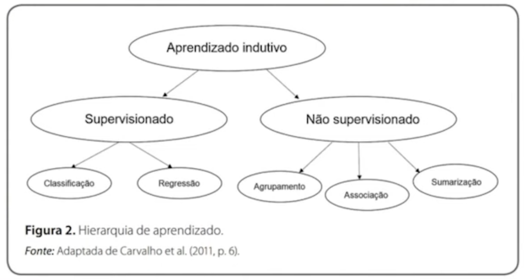
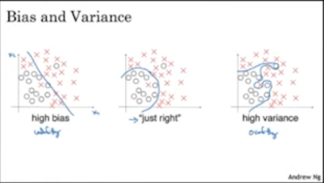

# Machine Learning

Biblioteca utilizada: scikit-learning  
https://scikit-learn.org/stable/

## **Computação Tradicional e ML**

**Computação tradicional**: programadores criam programas para que os computadores possam executar.  

**ML**: computadores criam seus próprios procedimentos a partir da observação sobre dados e seus resultados, ou sobre a estrutura e organização de um conjunto de dados.

____

**Machine Leaning**

Capacidade de computadores:
* aprenderem a realizar uma tarefa ao invés de serem programados para tal.  
* criarem um modelo (induzirem a uma função ou hipótese) que aprenderam com os dados.  

Os algoritmos de ML aprendem a induzir uma função ou hipótese capaz de resolver um problema a partir de dados que representam instâncias do problema a ser resolvido.

Indução de uma hipótese (ou aproximação de função) a partir da experiência passada.  

Deve ocorrer o desenvolvimento de métricas, a partir das quais as máquinas devem ser capazes de criar hipóteses e resolvê-las.  

Entender, a partir dos dados de entrada, como chegou-se na resposta, para sempre que forem inseridos novos dados, obtenha-se a mesma resposta.

Principais impulsionadores:
* uso de dados como evidência e para tomada de decisão
* contexto de Big Data

Ex.: baseado no perfil, na navegação e/ou na compra de um produto em um e-commerce, o sistema é capaz de recomendar um novo produto para o cliente (com a máxima capacidade de acerto que ele também vai adquiri-lo).

Conforme Amaral (2016) ML é a aplicação de técnicas computacionais com o objetivo de encontrar padrões ocultos em dados, ou seja características que não podem ser observadas tão claramente nos dados.

**Modelo ou Modelagem**  
Especificação de uma relação matemática (ou probabilística) entre diferentes variáveis.

___

## **Tipos**

### **Supervisionado (preditivo)**

Normalmente preditivo, traz um objetivo estabelecido.  

Os métodos recebem como entrada dados rotulados e usam esses dados e seus atributos para determinar um novo conjunto de dados desconhecidos.  

Passam por um treinamento, na qual o classificador aprenderá um determinado padrão de acordo com os dados utilizados para treinar o sistema.

Resolve problemas de:
**Regressão**:  
mapeiam um exemplo em um valor real e tenta aproximá-lo desse valor criando um novo.  
Ex.: prever o tempo de internação de um paciente no hospital.

**Classificação**:  
associa a descrição de um objeto a uma classe já existente. 
Ex.: determina a doença de um paciente pelos seus sintomas.

### **Não supervisionado (descritivo)**
Normalmente descritivo, quando o objetivo não está bem definido e temos o intuito de compreender melhor os dados para realizar agrupamento.  

Agrupam-se objetos de acordo com suas características criando associação entre eles.  

Resolve problemas de:
**Agrupamento (clustering)**: dados agrupados de acordo com sua similaridade.  

**Sumarização**: busca encontrar um descrição simples e compacta para um conjunto de dados.  

**Associação**: encontrar padrões frequentes de associações entre os atributos de um conjunto de dados.

### **Por reforço**
Quando as saídas não estão bem definidas e as respostas só podem ser aferidas após algumas execuções.

___

## **Hierarquia**

## **Treino e Teste**

Após os dados já terem passado pelo pré-processamento, inicia-se uma dividão dos dados para que o algotimo possa ser treinado.  

Geralmente divide-se o conjunto de dados em torno de 8/2, 7/3 entre treiono e teste.  

Dados de:
* treino: utilizados para criar o modelo (treinar).  
* teste: verificar se o modelo realmente atende às expectativas.

## Conceitos
### **Overfitting**
Sobreajuste  
Quando se ajusta um modelo muito de perto às particularidades do conjunto de treinamento e obtém um modelo que funciona bem no conjunto de treinamento, mas não é capaz de generalizar para novos dados.  

### **Underfitting**
Subajuste  
Modelo simples demais.  
Modelos muito simples podenm não ser capazes de capturar todos os aspectos e variabilidade dos dados, saindo-se mal, mesmo no conjunto de treinamento.  
No treinamento já é possível identificar que o modelo não se adapta ao conjunto de dados.  
Se colocar dados diferentes ele tentará aproximar ao máximo aos dados de treinamento, sem fazer reajustes.  

### **Viés**
(bias em inglês) 
Capacidade de um modelo em estabelecer a relação entre as variáveis e o objeto a ser predito.  

### **Variância**
Sensibilidade de um modelo.  
Modelos muito sensíveis ao treinamento, não são capazes de acertar os resultados nos dados do teste.

### **Regularização**
Técnica utilizada para minimizar problemas de variância.  
Processo de penalização nos dados, de forma a minimizar o erro de generalização do modelo sem afetar muito o modelo baseado no treinamento.
