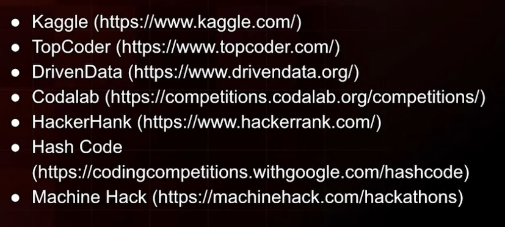

# Cientista de dados
* fazer análises profundas;
* dominar linguagens de programação (Python, R);
* pensar em modelos a serem aplicados;
* dominar probabilidade e algebra linear;
* experimentar novas técnicas matemáticas e estatísticas;
* pensar em modelos apropriados de experimentação de dados;
* capacidade de entender o contexto dos dados que está trabalhando.

## Papel
* planejar a coleta de dados;
* fazer análises exploratórias;
* criar hipóteses;
* escolher, definir ou criar um modelo estatístico;
* realizar muitos testes;
* demonstrar resultados (visualização), contar história (storytelling);
* estruturar um produto (definir como será a cadeia de alimentação e consumo de dados);
    * serializar seu código para alimentar outro sistema;
    * usar container;
    * criar API.

 

## Vagas
O que vai fazer?

* Coletar, limpar e preparar dados para análise.
* Desenvolver modelos preditivos e algoritmos de machine learning.
* Realizar análises estatísticas avançadas e interpretar resultados.
* Criar visualizações de dados claras e eficazes.
* Colaborar com as equipes de negócios para entender as necessidades e objetivos.
* Fornecer insights acionáveis e recomendações com base nas análises.
* Manter-se atualizado com as tendências e avanços na área de ciência de dados.
* Configurar e gerenciar instâncias em cloud (por exemplo, AWS, Azure, GCP) para treinamento de modelos.
* Aplicar técnicas de reconhecimento de padrões, incluindo, mas não se limitando à: redes neurais convolucionais (CNN), modelos de linguagem para processamento de linguagem natural (NLP) e árvores de decisão para classificação de dados.

O que é necessário?

* Experiência em ciência de dados.
* Proficiência em linguagens de programação, como Python e R.
* Experiência com Python e/ou R para construção de modelos.
* Experiência com bibliotecas de machine learning, como Scikit-Learn e Tensor Flow.
* Experiência com técnicas de modelagem descritiva e preditiva.
* Experiência na construção de ETL.
* Excelentes habilidades de comunicação e capacidade de explicar resultados complexos de forma clara.
* Atitude proativa e orientada para resultados.
* Mestrado ou Doutorado em aprendizado de máquina, matemática, ciência da computação ou áreas afins. (desejável)
* Experiência e conhecimento em processamento de dados, modelagem de dados, algoritmos e arquitetura de dados.
* Conhecimento em análise exploratória e mineração de dados
* INGLÊS Avançado (Conversação)
* Experiência em programação linear e otimização. (desejável)
* Experiência na liderança de um projeto técnico em contexto empresarial
* experiência prática no desenvolvimento e aplicação de soluções baseadas em dados em ambiente corporativo ou de consultoria, preferencialmente em contexto de bens de consumo
* Conhecimento sólido em métodos de machine learning supervisionado e não supervisionado (e.g. regressão, classificação, clusterização)
* Conhecimento em modelagem estatística. Estatística descritiva e inferencial. Distribuição e normalidade, intervalo de confiança, estatística descritiva, testes de hipótese.
* Computação em nuvem (AWS, Azure and Databricks)

O que é desejável?

* Conhecimento sólido em SQL e bancos de dados relacionais.
* Habilidade em ferramentas de visualização de dados, como Tableau, Power BI ou matplotlib.
* Familiaridade com técnicas de processamento de linguagem natural (NLP) e visão computacional.
* Experiência na configuração e gerenciamento de instâncias em cloud para treinamento de modelos.